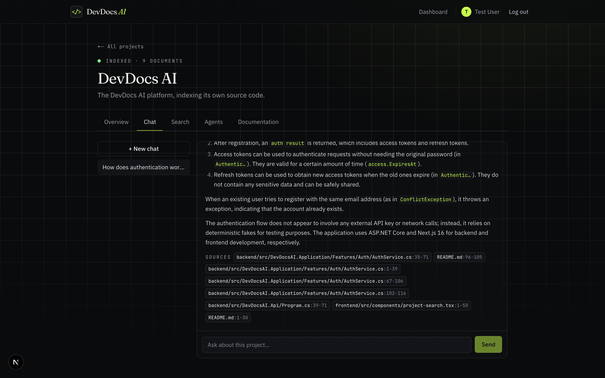
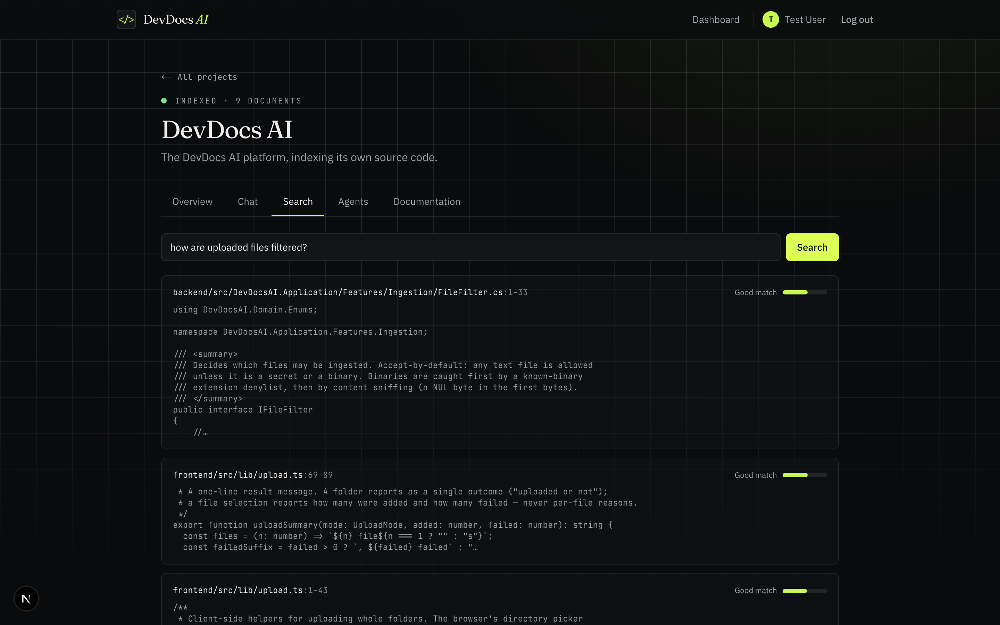
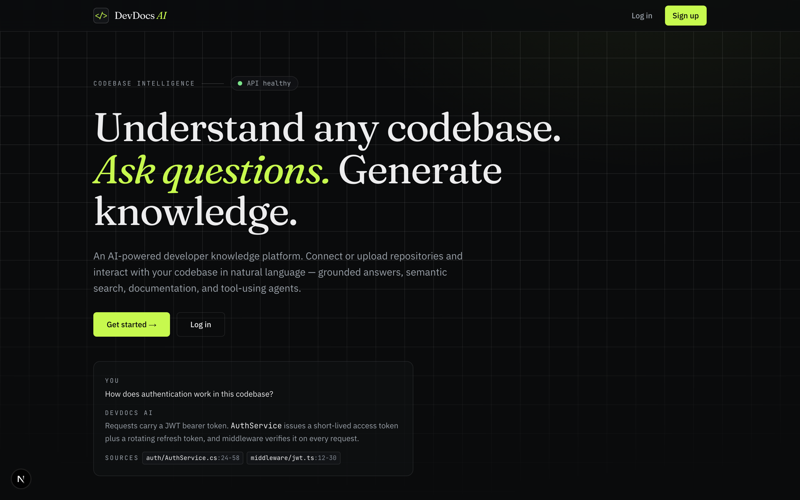
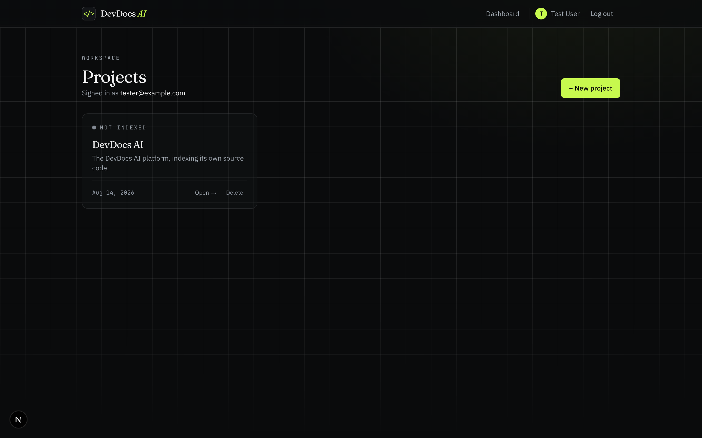
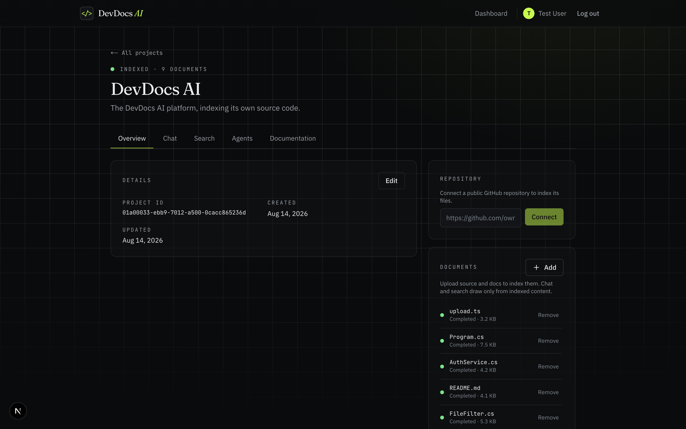
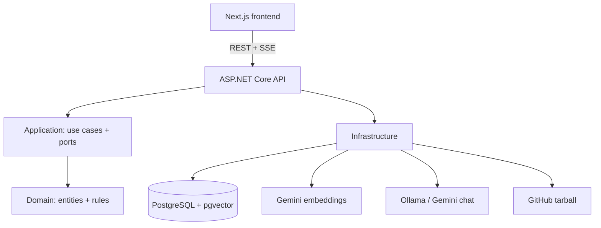

# DevDocs AI

Understand any codebase through grounded, citation-backed AI. Upload files or connect a public
GitHub repo, then chat, search, and run specialised agents over your project - every answer cites
the source it came from.

Built as a portfolio project in nine incremental, tested phases. Backend: ASP.NET Core (.NET 10),
clean architecture, PostgreSQL + pgvector. Frontend: Next.js 16 / React 19 / Tailwind v4.

## Screenshots

**Grounded chat** - answers are streamed token-by-token and cite the exact files and line ranges they came from:



**Semantic search** - find code by meaning, ranked by relevance:



<table>
  <tr>
    <td width="50%"><br /><sub><b>Landing</b></sub></td>
    <td width="50%"><br /><sub><b>Projects dashboard</b></sub></td>
  </tr>
  <tr>
    <td colspan="2"><br /><sub><b>Project overview - upload files, connect a repo, track indexing</b></sub></td>
  </tr>
</table>

## What it does

- **Grounded RAG chat** - ask questions and get answers grounded in your files, streamed token by
  token (SSE), with file + line-range citations. The assistant says "not in the project context"
  rather than hallucinating.
- **Semantic search** - vector search over your indexed code and docs.
- **GitHub ingestion** - connect a public repo; it's downloaded and indexed through the same pipeline.
- **AI agents + tools** - four ReAct agents (Code Explorer, Documentation Generator, Bug Analysis,
  Architecture Analyst) that call tools (search, read file, project structure) and expose an
  observable trace of every tool call.
- **Multi-tenant security** - JWT auth with rotating refresh tokens; every resource is owner-scoped
  and cross-tenant access is provably denied by tests.
- **Production posture** - rate limiting, RFC-7807 error handling, structured logging, usage
  tracking, Docker, and CI.

## Architecture



Dependencies point inward (`Api → Application → Domain`, `Infrastructure → Application/Domain`); the
Domain has zero framework/provider dependencies, enforced by an architecture test.

## The nine phases

1. Foundation (solution, Docker, config, health, CI)
2. Auth (JWT + rotating refresh) + Projects (owner-scoped CRUD)
3. File ingestion (upload, filtering, secret denylist, background queue)
4. Text processing (line-aware chunking)
5. RAG (Gemini embeddings, pgvector, grounded answers)
6. AI chat (conversations, SSE streaming, chat/search/upload UI)
7. GitHub integration (public repo → tarball → indexed)
8. Agents & tools (ReAct loop, 3 tools, observable traces)
9. Production quality (rate limiting, usage tracking, security pass, docs)

## Key decisions

- **pgvector** behind `IVectorStore` - Postgres-native, easy local, swappable.
- **Gemini embeddings + Ollama chat** (both free) behind `IEmbeddingService` / `IChatCompletionService`;
  the chat provider is config-switchable (`Ai:ChatProvider`).
- **ReAct tool-calling** (JSON actions over plain text completion) — provider-agnostic, works with the
  free/local models with no change to the chat port.
- No MediatR / AutoMapper / FluentAssertions (licensing) — plain handlers, manual mapping, Shouldly.

## Getting started

### With Docker (everything)

```bash
cp .env.example .env      # then set Gemini__ApiKey (free key from Google AI Studio)
docker compose up --build
```

- Web: http://localhost:3000 · API: http://localhost:8080 · API docs: http://localhost:8080/scalar

### Local dev

Prereqs: .NET 10 SDK, Node 22, Docker (for Postgres), and (for local chat) [Ollama](https://ollama.com)
running `ollama pull llama3.2`.

```bash
# Postgres
docker compose up -d db

# API (from backend/src/DevDocsAI.Api)
dotnet user-secrets set "Gemini:ApiKey" "<your-free-gemini-key>"
dotnet run

# Frontend (from frontend/)
npm install && npm run dev
```

## Tests

```bash
cd backend && dotnet test      # unit + Testcontainers integration (needs Docker)
cd frontend && npm run lint && npm run build
```

Tests use deterministic fakes for the AI providers, so the full suite passes with no API key or
network. CI (GitHub Actions) runs backend build+test and frontend lint+build on every push/PR.

## Configuration

All secrets come from environment variables / `.env` (gitignored); `.env.example` documents every
key. Non-secret defaults live in `appsettings.json`. Nothing sensitive is ever committed or logged.

## Author

Designed and built by **Harshal Joshi** - Full-Stack & AI Engineer.

- GitHub: [@Harshaljoshi1721](https://github.com/Harshaljoshi1721)
- LinkedIn: [harshaljoshi1721](https://linkedin.com/in/harshaljoshi1721)

## License

MIT © 2026 Harshal Joshi - see [LICENSE](LICENSE). You're welcome to learn from and build on
this code; the copyright notice must be retained.
