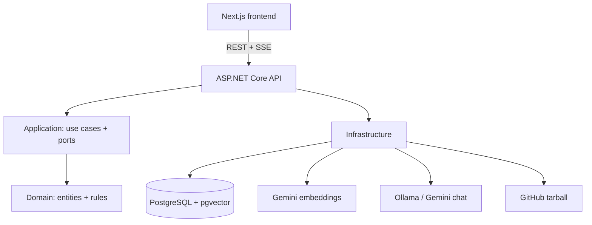

# Production Quality (Phase 9) Implementation Plan

> **For agentic workers:** REQUIRED SUB-SKILL: Use superpowers:subagent-driven-development (recommended) or superpowers:executing-plans to implement this plan task-by-task. Steps use checkbox (`- [ ]`) syntax for tracking.

**Goal:** Finish the app for production: rate limiting on auth + AI endpoints, usage tracking (`UsageRecord` + summary), a security/hardening pass (headers, log enrichment, locked-in safe errors), and a real README.

**Architecture:** Additive and cross-cutting. Usage is recorded best-effort via an `IUsageRecorder` from the three user-facing AI services. Rate limiting uses ASP.NET Core's built-in limiter with config-driven per-user/IP policies. Security is two small middlewares + a unit test on the existing exception handler.

**Tech Stack:** .NET 10, ASP.NET Core rate limiting (built-in), EF Core 10 + Npgsql, Serilog `LogContext`, xUnit + Shouldly + NSubstitute + Testcontainers; Next.js 16 frontend.

**Design source:** [`docs/superpowers/specs/2026-07-28-production-quality-design.md`](../specs/2026-07-28-production-quality-design.md).

> **Git:** branch `phase-9-production` from `main`. **Run `git` from the repo ROOT** (a `cd backend && git add backend/...` double-prefixes and fails). Per-task commits; local only. Backend cmds from `backend/`, frontend from `frontend/`. Docker required for integration tests.
>
> **Setup:** `cd /Users/harshaljoshi/Projects/DevDocs-AI && git switch -c phase-9-production`

---

## File structure

**Domain:** `Enums/UsageKind.cs`, `Entities/UsageRecord.cs`
**Application:** `Features/Usage/TokenEstimator.cs`, `Features/Usage/IUsageRecorder.cs` (+`UsageRecorder`), `Features/Usage/UsageService.cs` (+DTOs), modify `Abstractions/Persistence/Repositories.cs` (+`IUsageRecordRepository`), modify `Features/Rag/RagService.cs`, `Features/Chat/ChatService.cs`, `Features/Agents/AgentService.cs`, `DependencyInjection.cs`
**Infrastructure:** `Persistence/Configurations/UsageRecordConfiguration.cs`, `Persistence/Repositories/UsageRecordRepository.cs`, modify `Persistence/AppDbContext.cs`, `DependencyInjection.cs`; migration `AddUsageRecords`
**Api:** `Configuration/RateLimitOptions.cs`, `Infrastructure/SecurityHeadersMiddleware.cs`, `Infrastructure/RequestContextMiddleware.cs`, `Controllers/UsageController.cs`, modify `Program.cs`, `Controllers/{Auth,Rag,Conversations,Agents}Controller.cs`
**Frontend:** `lib/types.ts`, `components/project-usage.tsx`, modify `app/projects/[id]/page.tsx`
**Docs:** `README.md`
**Tests:** `UnitTests/Features/{TokenEstimatorTests,UsageRecorderTests,UsageServiceTests}.cs`, modify `UnitTests/Features/{RagServiceTests,ChatServiceTests,AgentServiceTests}.cs`; `IntegrationTests/{UsageEndpointsTests,RateLimitTests,SecurityTests}.cs`, `IntegrationTests/GlobalExceptionHandlerTests.cs`, modify `IntegrationTests/Infrastructure/DevDocsApiFactory.cs`

---

## Task 1: Domain — `UsageRecord`

**Files:** Create `src/DevDocsAI.Domain/Enums/UsageKind.cs`, `src/DevDocsAI.Domain/Entities/UsageRecord.cs`; Test `tests/DevDocsAI.UnitTests/Features/UsageRecordTests.cs`

- [ ] **Step 1: Write the failing test** — `tests/DevDocsAI.UnitTests/Features/UsageRecordTests.cs`:
```csharp
using DevDocsAI.Domain.Entities;
using DevDocsAI.Domain.Enums;
using Shouldly;
using Xunit;

namespace DevDocsAI.UnitTests.Features;

public sealed class UsageRecordTests
{
    [Fact]
    public void Create_sets_all_fields()
    {
        var userId = Guid.CreateVersion7();
        var projectId = Guid.CreateVersion7();

        var record = UsageRecord.Create(userId, projectId, UsageKind.Chat, 120, 45);

        record.UserId.ShouldBe(userId);
        record.ProjectId.ShouldBe(projectId);
        record.Kind.ShouldBe(UsageKind.Chat);
        record.TokensIn.ShouldBe(120);
        record.TokensOut.ShouldBe(45);
        record.CostEstimate.ShouldBeNull();
    }
}
```

- [ ] **Step 2: Run — FAIL:** `dotnet test tests/DevDocsAI.UnitTests/DevDocsAI.UnitTests.csproj --filter "FullyQualifiedName~UsageRecordTests"`

- [ ] **Step 3: Create the enum** — `src/DevDocsAI.Domain/Enums/UsageKind.cs`:
```csharp
namespace DevDocsAI.Domain.Enums;

/// <summary>The kind of AI operation a usage record accounts for.</summary>
public enum UsageKind
{
    Ask = 0,
    Chat = 1,
    AgentRun = 2,
}
```

- [ ] **Step 4: Create the entity** — `src/DevDocsAI.Domain/Entities/UsageRecord.cs`:
```csharp
using DevDocsAI.Domain.Common;
using DevDocsAI.Domain.Enums;

namespace DevDocsAI.Domain.Entities;

/// <summary>
/// A metered AI operation: which user/project incurred it, its kind, and the
/// (estimated) token counts. Enables usage summaries and future cost tracking.
/// </summary>
public sealed class UsageRecord : Entity
{
    private UsageRecord() { } // EF

    private UsageRecord(Guid userId, Guid projectId, UsageKind kind, int tokensIn, int tokensOut)
    {
        UserId = userId;
        ProjectId = projectId;
        Kind = kind;
        TokensIn = tokensIn;
        TokensOut = tokensOut;
    }

    public Guid UserId { get; private set; }
    public Guid ProjectId { get; private set; }
    public UsageKind Kind { get; private set; }
    public int TokensIn { get; private set; }
    public int TokensOut { get; private set; }
    public decimal? CostEstimate { get; private set; }

    public static UsageRecord Create(Guid userId, Guid projectId, UsageKind kind, int tokensIn, int tokensOut) =>
        new(userId, projectId, kind, tokensIn, tokensOut);
}
```

- [ ] **Step 5: Run — PASS.** **Step 6: Commit**
```bash
git add src/DevDocsAI.Domain tests/DevDocsAI.UnitTests/Features/UsageRecordTests.cs
git commit -m "feat(domain): UsageRecord entity + UsageKind"
```

---

## Task 2: Application — estimator, recorder, service

**Files:** Create `src/DevDocsAI.Application/Features/Usage/TokenEstimator.cs`, `.../IUsageRecorder.cs`, `.../UsageService.cs`; Modify `src/DevDocsAI.Application/Abstractions/Persistence/Repositories.cs`, `src/DevDocsAI.Application/DependencyInjection.cs`; Tests `tests/DevDocsAI.UnitTests/Features/{TokenEstimatorTests,UsageRecorderTests,UsageServiceTests}.cs`

- [ ] **Step 1: Add the repository port** — in `src/DevDocsAI.Application/Abstractions/Persistence/Repositories.cs`, add:
```csharp
public interface IUsageRecordRepository
{
    Task AddAsync(UsageRecord record, CancellationToken ct);
    Task<IReadOnlyList<UsageRecord>> ListByProjectAsync(Guid projectId, CancellationToken ct);
}
```

- [ ] **Step 2: Write the failing tests** — `tests/DevDocsAI.UnitTests/Features/TokenEstimatorTests.cs`:
```csharp
using DevDocsAI.Application.Features.Usage;
using Shouldly;
using Xunit;

namespace DevDocsAI.UnitTests.Features;

public sealed class TokenEstimatorTests
{
    [Theory]
    [InlineData("", 0)]
    [InlineData("abcd", 1)]
    [InlineData("abcde", 2)]
    public void Estimate_is_roughly_length_over_four(string text, int expected) =>
        TokenEstimator.Estimate(text).ShouldBe(expected);

    [Fact]
    public void Estimate_null_is_zero() => TokenEstimator.Estimate(null).ShouldBe(0);
}
```
`tests/DevDocsAI.UnitTests/Features/UsageRecorderTests.cs`:
```csharp
using DevDocsAI.Application.Abstractions.Persistence;
using DevDocsAI.Application.Features.Usage;
using DevDocsAI.Domain.Entities;
using DevDocsAI.Domain.Enums;
using Microsoft.Extensions.Logging.Abstractions;
using NSubstitute;
using NSubstitute.ExceptionExtensions;
using Shouldly;
using Xunit;

namespace DevDocsAI.UnitTests.Features;

public sealed class UsageRecorderTests
{
    private readonly IUsageRecordRepository _repo = Substitute.For<IUsageRecordRepository>();
    private readonly IUnitOfWork _uow = Substitute.For<IUnitOfWork>();
    private readonly UsageRecorder _sut;
    private readonly Guid _userId = Guid.CreateVersion7();
    private readonly Guid _projectId = Guid.CreateVersion7();

    public UsageRecorderTests() =>
        _sut = new UsageRecorder(_repo, _uow, NullLogger<UsageRecorder>.Instance);

    [Fact]
    public async Task Record_persists_a_usage_record()
    {
        await _sut.RecordAsync(_userId, _projectId, UsageKind.Chat, 100, 20, default);

        await _repo.Received(1).AddAsync(
            Arg.Is<UsageRecord>(r => r.Kind == UsageKind.Chat && r.TokensIn == 100 && r.TokensOut == 20), default);
        await _uow.Received(1).SaveChangesAsync(default);
    }

    [Fact]
    public async Task Record_swallows_failures_so_it_never_breaks_the_caller()
    {
        _uow.SaveChangesAsync(Arg.Any<CancellationToken>()).Throws(new InvalidOperationException("db down"));

        // Must NOT throw.
        await Should.NotThrowAsync(() => _sut.RecordAsync(_userId, _projectId, UsageKind.Ask, 1, 1, default));
    }
}
```
`tests/DevDocsAI.UnitTests/Features/UsageServiceTests.cs`:
```csharp
using DevDocsAI.Application.Abstractions.Persistence;
using DevDocsAI.Application.Common.Exceptions;
using DevDocsAI.Application.Features.Usage;
using DevDocsAI.Domain.Entities;
using DevDocsAI.Domain.Enums;
using NSubstitute;
using Shouldly;
using Xunit;

namespace DevDocsAI.UnitTests.Features;

public sealed class UsageServiceTests
{
    private readonly IProjectRepository _projects = Substitute.For<IProjectRepository>();
    private readonly IUsageRecordRepository _repo = Substitute.For<IUsageRecordRepository>();
    private readonly UsageService _sut;
    private readonly Guid _userId = Guid.CreateVersion7();
    private readonly Guid _projectId = Guid.CreateVersion7();

    public UsageServiceTests()
    {
        _sut = new UsageService(_projects, _repo);
        _projects.GetByIdAsync(_projectId, Arg.Any<CancellationToken>())
            .Returns(Project.Create("Proj", null, _userId));
    }

    [Fact]
    public async Task Summarize_aggregates_totals_and_by_kind()
    {
        _repo.ListByProjectAsync(_projectId, Arg.Any<CancellationToken>()).Returns(new List<UsageRecord>
        {
            UsageRecord.Create(_userId, _projectId, UsageKind.Chat, 100, 20),
            UsageRecord.Create(_userId, _projectId, UsageKind.Chat, 50, 10),
            UsageRecord.Create(_userId, _projectId, UsageKind.Ask, 30, 5),
        });

        var summary = await _sut.SummarizeAsync(_userId, _projectId, default);

        summary.TotalRequests.ShouldBe(3);
        summary.TotalTokensIn.ShouldBe(180);
        summary.TotalTokensOut.ShouldBe(35);
        summary.ByKind.ShouldContain(k => k.Kind == "Chat" && k.Requests == 2);
    }

    [Fact]
    public async Task Summarize_on_another_users_project_is_not_found()
    {
        _projects.GetByIdAsync(_projectId, Arg.Any<CancellationToken>())
            .Returns(Project.Create("Proj", null, Guid.CreateVersion7()));

        await Should.ThrowAsync<NotFoundException>(() => _sut.SummarizeAsync(_userId, _projectId, default));
    }
}
```

- [ ] **Step 3: Run — FAIL** (compile): `dotnet test tests/DevDocsAI.UnitTests/DevDocsAI.UnitTests.csproj --filter "FullyQualifiedName~Usage|FullyQualifiedName~TokenEstimator"`

- [ ] **Step 4: Implement the estimator** — `src/DevDocsAI.Application/Features/Usage/TokenEstimator.cs`:
```csharp
namespace DevDocsAI.Application.Features.Usage;

/// <summary>Rough token estimate (~4 chars/token). Provider-agnostic; exact counts are a future refinement.</summary>
public static class TokenEstimator
{
    public static int Estimate(string? text) => string.IsNullOrEmpty(text) ? 0 : (text.Length + 3) / 4;
}
```

- [ ] **Step 5: Implement the recorder** — `src/DevDocsAI.Application/Features/Usage/IUsageRecorder.cs`:
```csharp
using DevDocsAI.Application.Abstractions.Persistence;
using DevDocsAI.Domain.Entities;
using DevDocsAI.Domain.Enums;
using Microsoft.Extensions.Logging;

namespace DevDocsAI.Application.Features.Usage;

/// <summary>Records AI usage. Best-effort: it must never break the user's request.</summary>
public interface IUsageRecorder
{
    Task RecordAsync(Guid userId, Guid projectId, UsageKind kind, int tokensIn, int tokensOut, CancellationToken ct);
}

public sealed class UsageRecorder(
    IUsageRecordRepository repository, IUnitOfWork unitOfWork, ILogger<UsageRecorder> logger) : IUsageRecorder
{
    public async Task RecordAsync(
        Guid userId, Guid projectId, UsageKind kind, int tokensIn, int tokensOut, CancellationToken ct)
    {
        try
        {
            await repository.AddAsync(UsageRecord.Create(userId, projectId, kind, tokensIn, tokensOut), ct);
            await unitOfWork.SaveChangesAsync(ct);
        }
        catch (Exception ex) when (ex is not OperationCanceledException)
        {
            logger.LogWarning(ex, "Failed to record {Kind} usage for user {UserId} in project {ProjectId}",
                kind, userId, projectId);
        }
    }
}
```

- [ ] **Step 6: Implement the summary service** — `src/DevDocsAI.Application/Features/Usage/UsageService.cs`:
```csharp
using DevDocsAI.Application.Abstractions.Persistence;
using DevDocsAI.Application.Common.Exceptions;

namespace DevDocsAI.Application.Features.Usage;

public sealed record UsageByKind(string Kind, int Requests, long TokensIn, long TokensOut);

public sealed record UsageSummaryResponse(
    int TotalRequests, long TotalTokensIn, long TotalTokensOut, IReadOnlyList<UsageByKind> ByKind);

public interface IUsageService
{
    Task<UsageSummaryResponse> SummarizeAsync(Guid userId, Guid projectId, CancellationToken ct);
}

public sealed class UsageService(IProjectRepository projects, IUsageRecordRepository usage) : IUsageService
{
    public async Task<UsageSummaryResponse> SummarizeAsync(Guid userId, Guid projectId, CancellationToken ct)
    {
        var project = await projects.GetByIdAsync(projectId, ct);
        if (project is null || project.OwnerId != userId)
        {
            throw new NotFoundException("Project not found.");
        }

        var records = await usage.ListByProjectAsync(projectId, ct);

        var byKind = records
            .GroupBy(r => r.Kind)
            .Select(g => new UsageByKind(
                g.Key.ToString(), g.Count(), g.Sum(r => (long)r.TokensIn), g.Sum(r => (long)r.TokensOut)))
            .OrderBy(k => k.Kind, StringComparer.Ordinal)
            .ToList();

        return new UsageSummaryResponse(
            records.Count, records.Sum(r => (long)r.TokensIn), records.Sum(r => (long)r.TokensOut), byKind);
    }
}
```

- [ ] **Step 7: Register in DI** — in `src/DevDocsAI.Application/DependencyInjection.cs` add and ensure `using DevDocsAI.Application.Features.Usage;`:
```csharp
        services.AddScoped<IUsageRecorder, UsageRecorder>();
        services.AddScoped<IUsageService, UsageService>();
```

- [ ] **Step 8: Build check for ILogger** — `dotnet build src/DevDocsAI.Application/DevDocsAI.Application.csproj`. If it errors on `Microsoft.Extensions.Logging`, add the package:
```bash
dotnet add src/DevDocsAI.Application/DevDocsAI.Application.csproj package Microsoft.Extensions.Logging.Abstractions
```
(The Application project already logs elsewhere, so this is usually already referenced.) Expected: Build succeeded, 0 warnings.

- [ ] **Step 9: Run — PASS** (7 tests). **Step 10: Commit**
```bash
git add src/DevDocsAI.Application tests/DevDocsAI.UnitTests/Features/TokenEstimatorTests.cs tests/DevDocsAI.UnitTests/Features/UsageRecorderTests.cs tests/DevDocsAI.UnitTests/Features/UsageServiceTests.cs
git commit -m "feat(app): usage recorder, token estimator, summary service"
```

---

## Task 3: Infrastructure — persistence + migration

**Files:** Create `src/DevDocsAI.Infrastructure/Persistence/Configurations/UsageRecordConfiguration.cs`, `src/DevDocsAI.Infrastructure/Persistence/Repositories/UsageRecordRepository.cs`; Modify `src/DevDocsAI.Infrastructure/Persistence/AppDbContext.cs`, `src/DevDocsAI.Infrastructure/DependencyInjection.cs`; migration `AddUsageRecords`

- [ ] **Step 1: EF config** — `src/DevDocsAI.Infrastructure/Persistence/Configurations/UsageRecordConfiguration.cs`:
```csharp
using DevDocsAI.Domain.Entities;
using Microsoft.EntityFrameworkCore;
using Microsoft.EntityFrameworkCore.Metadata.Builders;

namespace DevDocsAI.Infrastructure.Persistence.Configurations;

public sealed class UsageRecordConfiguration : IEntityTypeConfiguration<UsageRecord>
{
    public void Configure(EntityTypeBuilder<UsageRecord> builder)
    {
        builder.ToTable("usage_records");
        builder.HasKey(r => r.Id);
        builder.Property(r => r.Id).ValueGeneratedNever();
        builder.Property(r => r.Kind).HasConversion<string>().HasMaxLength(32);
        builder.Property(r => r.CostEstimate).HasColumnType("numeric(12,6)");

        builder.HasIndex(r => r.ProjectId);
        builder.HasIndex(r => r.UserId);

        builder.HasOne<Project>()
            .WithMany()
            .HasForeignKey(r => r.ProjectId)
            .OnDelete(DeleteBehavior.Cascade);

        builder.HasOne<User>()
            .WithMany()
            .HasForeignKey(r => r.UserId)
            .OnDelete(DeleteBehavior.NoAction);
    }
}
```

- [ ] **Step 2: Repository** — `src/DevDocsAI.Infrastructure/Persistence/Repositories/UsageRecordRepository.cs`:
```csharp
using DevDocsAI.Application.Abstractions.Persistence;
using DevDocsAI.Domain.Entities;
using Microsoft.EntityFrameworkCore;

namespace DevDocsAI.Infrastructure.Persistence.Repositories;

public sealed class UsageRecordRepository(AppDbContext db) : IUsageRecordRepository
{
    public async Task AddAsync(UsageRecord record, CancellationToken ct) =>
        await db.UsageRecords.AddAsync(record, ct);

    public async Task<IReadOnlyList<UsageRecord>> ListByProjectAsync(Guid projectId, CancellationToken ct) =>
        await db.UsageRecords.Where(r => r.ProjectId == projectId).ToListAsync(ct);
}
```

- [ ] **Step 3: DbSet** — in `src/DevDocsAI.Infrastructure/Persistence/AppDbContext.cs` add:
```csharp
    public DbSet<UsageRecord> UsageRecords => Set<UsageRecord>();
```

- [ ] **Step 4: Register repo** — in `src/DevDocsAI.Infrastructure/DependencyInjection.cs` add with the other repos:
```csharp
        services.AddScoped<IUsageRecordRepository, UsageRecordRepository>();
```

- [ ] **Step 5: Build + migration**
```bash
dotnet build src/DevDocsAI.Api/DevDocsAI.Api.csproj
dotnet ef migrations add AddUsageRecords --project src/DevDocsAI.Infrastructure --startup-project src/DevDocsAI.Api --output-dir Persistence/Migrations
```
Expected: build succeeded; migration "Done." — verify it creates `usage_records` and no other table changes.

- [ ] **Step 6: Commit**
```bash
git add src/DevDocsAI.Infrastructure
git commit -m "feat(infra): usage_records persistence + migration"
```

---

## Task 4: Record usage from the AI services

**Files:** Modify `src/DevDocsAI.Application/Features/Rag/RagService.cs`, `src/DevDocsAI.Application/Features/Chat/ChatService.cs`, `src/DevDocsAI.Application/Features/Agents/AgentService.cs`; Modify tests `tests/DevDocsAI.UnitTests/Features/{RagServiceTests,ChatServiceTests,AgentServiceTests}.cs`

- [ ] **Step 1: Update `RagServiceTests` for the new dependency** — in `tests/DevDocsAI.UnitTests/Features/RagServiceTests.cs`, add a field and pass it to the constructor:
```csharp
    private readonly IUsageRecorder _usage = Substitute.For<IUsageRecorder>();
```
Change the `_sut` construction to:
```csharp
        _sut = new RagService(_projects, _retrieval, _chat, _usage);
```
Add `using DevDocsAI.Application.Features.Usage;` at the top.

- [ ] **Step 2: Add recording to `RagService`** — in `src/DevDocsAI.Application/Features/Rag/RagService.cs`: add `using DevDocsAI.Application.Features.Usage;` and `using DevDocsAI.Domain.Enums;`; add `IUsageRecorder usage` as the last constructor parameter:
```csharp
public sealed class RagService(
    IProjectRepository projects,
    IRetrievalService retrieval,
    IChatCompletionService chat,
    IUsageRecorder usage) : IRagService
```
In `AskAsync`, after `var completion = await chat.CompleteAsync(...)` and before building citations, add:
```csharp
        await usage.RecordAsync(userId, projectId, UsageKind.Ask,
            TokenEstimator.Estimate(GroundedChat.SystemPrompt + userMessage),
            TokenEstimator.Estimate(completion.Text), ct);
```

- [ ] **Step 3: Update `ChatServiceTests`** — in `tests/DevDocsAI.UnitTests/Features/ChatServiceTests.cs` add:
```csharp
    private readonly IUsageRecorder _usage = Substitute.For<IUsageRecorder>();
```
Change `_sut` to:
```csharp
        _sut = new ChatService(_projects, _conversations, _retrieval, _chat, _uow, _usage);
```
Add `using DevDocsAI.Application.Features.Usage;`.

- [ ] **Step 4: Add recording to `ChatService`** — in `src/DevDocsAI.Application/Features/Chat/ChatService.cs`: add `using DevDocsAI.Application.Features.Usage;`; add `IUsageRecorder usage` as the last constructor parameter. In `SendMessageAsync`, in the branch where the model is called (`hits.Count != 0`), after `var completion = await chat.CompleteAsync(...)`:
```csharp
            await usage.RecordAsync(userId, projectId, UsageKind.Chat,
                TokenEstimator.Estimate(request.Question), TokenEstimator.Estimate(completion.Text), ct);
```
In `StreamMessageAsync`, after the streaming loop builds `answer` (the else branch, non-empty hits), before `CompleteTurnAsync`:
```csharp
            await usage.RecordAsync(userId, projectId, UsageKind.Chat,
                TokenEstimator.Estimate(request.Question), TokenEstimator.Estimate(answer), ct);
```
(`UsageKind` is already imported via `DevDocsAI.Domain.Enums` in ChatService.)

- [ ] **Step 5: Update `AgentServiceTests`** — in `tests/DevDocsAI.UnitTests/Features/AgentServiceTests.cs` add:
```csharp
    private readonly IUsageRecorder _usage = Substitute.For<IUsageRecorder>();
```
Change the two `new AgentService(...)` constructions (in the ctor and in `Run_fails_after_max_iterations...`) to pass `_usage` as the last argument, e.g.:
```csharp
        _sut = new AgentService(_projects, _runs, registry, _chat, _uow, Options.Create(new AgentOptions()), _usage);
```
and:
```csharp
        var sut = new AgentService(_projects, _runs,
            new ToolRegistry(new IAgentTool[] { new SearchProjectTool(_retrieval, Options.Create(new AgentOptions())) }),
            _chat, _uow, Options.Create(new AgentOptions { MaxIterations = 2 }), _usage);
```
Add `using DevDocsAI.Application.Features.Usage;`.

- [ ] **Step 6: Add recording to `AgentService`** — in `src/DevDocsAI.Application/Features/Agents/AgentService.cs`: add `using DevDocsAI.Application.Features.Usage;`; add `IUsageRecorder usage` as the last constructor parameter. In `RunAsync`, after `await uow.SaveChangesAsync(ct);` (the run is persisted) and before `return Map(run);`:
```csharp
        await usage.RecordAsync(userId, projectId, UsageKind.AgentRun,
            TokenEstimator.Estimate(input), TokenEstimator.Estimate(run.Output ?? string.Empty), ct);
```

- [ ] **Step 7: Run the affected unit tests** — `dotnet test tests/DevDocsAI.UnitTests/DevDocsAI.UnitTests.csproj --filter "FullyQualifiedName~RagServiceTests|FullyQualifiedName~ChatServiceTests|FullyQualifiedName~AgentServiceTests"` — Expected: all pass (the substitute recorder does nothing).

- [ ] **Step 8: Build the whole backend** — `dotnet build` — Expected: succeeded, 0 warnings.

- [ ] **Step 9: Commit**
```bash
git add src/DevDocsAI.Application tests/DevDocsAI.UnitTests
git commit -m "feat(app): record Ask/Chat/AgentRun usage (best-effort)"
```

---

## Task 5: `UsageController` + integration test

**Files:** Create `src/DevDocsAI.Api/Controllers/UsageController.cs`, `tests/DevDocsAI.IntegrationTests/UsageEndpointsTests.cs`

- [ ] **Step 1: Controller** — `src/DevDocsAI.Api/Controllers/UsageController.cs`:
```csharp
using DevDocsAI.Application.Abstractions.Security;
using DevDocsAI.Application.Common.Exceptions;
using DevDocsAI.Application.Features.Usage;
using Microsoft.AspNetCore.Authorization;
using Microsoft.AspNetCore.Mvc;

namespace DevDocsAI.Api.Controllers;

/// <summary>AI usage summary for a project (Phase 9).</summary>
[ApiController]
[Authorize]
[Route("api/v1/projects/{projectId:guid}/usage")]
public sealed class UsageController(IUsageService usage, ICurrentUser currentUser) : ControllerBase
{
    private Guid UserId => currentUser.UserId
        ?? throw new AuthenticationException("The request is not authenticated.");

    [HttpGet]
    public async Task<ActionResult<UsageSummaryResponse>> Get(Guid projectId, CancellationToken ct)
        => Ok(await usage.SummarizeAsync(UserId, projectId, ct));
}
```

- [ ] **Step 2: Write the integration test** — `tests/DevDocsAI.IntegrationTests/UsageEndpointsTests.cs`:
```csharp
using System.Net;
using System.Net.Http.Headers;
using System.Net.Http.Json;
using System.Text;
using DevDocsAI.IntegrationTests.Infrastructure;
using Shouldly;
using Xunit;

namespace DevDocsAI.IntegrationTests;

[Collection(ApiCollection.Name)]
public sealed class UsageEndpointsTests(DevDocsApiFactory factory)
{
    private sealed record DocumentModel(Guid Id, string Status);
    private sealed record UploadResult(List<DocumentModel> Accepted);
    private sealed record UsageByKind(string Kind, int Requests, long TokensIn, long TokensOut);
    private sealed record UsageSummary(int TotalRequests, long TotalTokensIn, long TotalTokensOut, List<UsageByKind> ByKind);

    private const string Fact = "the answer is 42";

    [Fact]
    public async Task Asking_a_question_records_usage()
    {
        var (client, projectId) = await IndexedProjectAsync();

        var before = (await client.GetFromJsonAsync<UsageSummary>(
            $"/api/v1/projects/{projectId}/usage"))!;
        before.TotalRequests.ShouldBe(0);

        await client.PostAsJsonAsync($"/api/v1/projects/{projectId}/ask", new { question = Fact });

        var after = (await client.GetFromJsonAsync<UsageSummary>(
            $"/api/v1/projects/{projectId}/usage"))!;
        after.TotalRequests.ShouldBe(1);
        after.ByKind.ShouldContain(k => k.Kind == "Ask" && k.Requests == 1);
        after.TotalTokensOut.ShouldBeGreaterThan(0);
    }

    [Fact]
    public async Task Another_user_cannot_read_usage()
    {
        var (_, projectId) = await IndexedProjectAsync();
        var (intruder, _, _) = await factory.RegisterAsync();

        var response = await intruder.GetAsync($"/api/v1/projects/{projectId}/usage");
        response.StatusCode.ShouldBe(HttpStatusCode.NotFound);
    }

    private async Task<(HttpClient client, Guid projectId)> IndexedProjectAsync()
    {
        var (client, _, _) = await factory.RegisterAsync();
        var projectId = await client.CreateProjectAsync();

        var form = new MultipartFormDataContent();
        var part = new ByteArrayContent(Encoding.UTF8.GetBytes(Fact));
        part.Headers.ContentType = new MediaTypeHeaderValue("text/plain");
        form.Add(part, "files", "facts.md");
        var upload = (await (await client.PostAsync($"/api/v1/projects/{projectId}/documents", form))
            .Content.ReadFromJsonAsync<UploadResult>())!;
        await WaitUntilProcessedAsync(client, projectId, upload.Accepted.Single().Id);
        return (client, projectId);
    }

    private static async Task WaitUntilProcessedAsync(HttpClient client, Guid projectId, Guid documentId)
    {
        for (var attempt = 0; attempt < 50; attempt++)
        {
            var docs = await client.GetFromJsonAsync<List<DocumentModel>>(
                $"/api/v1/projects/{projectId}/documents");
            var doc = docs!.Single(d => d.Id == documentId);
            if (doc.Status is "Completed" or "Failed") { doc.Status.ShouldBe("Completed"); return; }
            await Task.Delay(200);
        }

        throw new Xunit.Sdk.XunitException("Document was not processed in time.");
    }
}
```

- [ ] **Step 3: Run** — `dotnet test tests/DevDocsAI.IntegrationTests/DevDocsAI.IntegrationTests.csproj --filter "FullyQualifiedName~UsageEndpointsTests"` — Expected: PASS (2 tests, Docker running).

- [ ] **Step 4: Commit**
```bash
git add src/DevDocsAI.Api/Controllers/UsageController.cs tests/DevDocsAI.IntegrationTests/UsageEndpointsTests.cs
git commit -m "feat(api): project usage summary endpoint + test"
```

---

## Task 6: Rate limiting

**Files:** Create `src/DevDocsAI.Api/Configuration/RateLimitOptions.cs`; Modify `src/DevDocsAI.Api/Program.cs`, `Controllers/AuthController.cs`, `Controllers/RagController.cs`, `Controllers/ConversationsController.cs`, `Controllers/AgentsController.cs`, `src/DevDocsAI.Api/appsettings.json`, `tests/DevDocsAI.IntegrationTests/Infrastructure/DevDocsApiFactory.cs`; Test `tests/DevDocsAI.IntegrationTests/RateLimitTests.cs`

- [ ] **Step 1: Options** — `src/DevDocsAI.Api/Configuration/RateLimitOptions.cs`:
```csharp
namespace DevDocsAI.Api.Configuration;

/// <summary>Rate-limit budgets per fixed window, bound from the "RateLimit" section.</summary>
public sealed class RateLimitOptions
{
    public const string SectionName = "RateLimit";

    public int AuthPermitPerWindow { get; init; } = 10;
    public int AiPermitPerWindow { get; init; } = 20;
    public int GlobalPermitPerWindow { get; init; } = 100;
    public int WindowSeconds { get; init; } = 60;
}
```

- [ ] **Step 2: Wire the limiter in `Program.cs`** — add usings near the top:
```csharp
using System.Threading.RateLimiting;
using Microsoft.AspNetCore.RateLimiting;
using Microsoft.IdentityModel.JsonWebTokens;
```
After `builder.Services.AddAuthorization();`, add:
```csharp
    var rateLimits = builder.Configuration.GetSection(RateLimitOptions.SectionName).Get<RateLimitOptions>()
        ?? new RateLimitOptions();
    builder.Services.AddRateLimiter(options =>
    {
        options.RejectionStatusCode = StatusCodes.Status429TooManyRequests;
        options.OnRejected = async (context, token) =>
        {
            if (context.Lease.TryGetMetadata(MetadataName.RetryAfter, out var retryAfter))
            {
                context.HttpContext.Response.Headers.RetryAfter =
                    ((int)retryAfter.TotalSeconds).ToString(System.Globalization.CultureInfo.InvariantCulture);
            }

            context.HttpContext.Response.StatusCode = StatusCodes.Status429TooManyRequests;
            var problem = new Microsoft.AspNetCore.Mvc.ProblemDetails
            {
                Status = StatusCodes.Status429TooManyRequests,
                Title = "Too many requests.",
                Detail = "Rate limit exceeded. Please slow down and try again shortly.",
            };
            problem.Extensions["traceId"] = context.HttpContext.TraceIdentifier;
            await context.HttpContext.Response.WriteAsJsonAsync(problem, token);
        };

        static string PartitionKey(HttpContext ctx) =>
            ctx.User.FindFirst(JwtRegisteredClaimNames.Sub)?.Value
            ?? ctx.Connection.RemoteIpAddress?.ToString()
            ?? "anonymous";

        RateLimitPartition<string> Window(HttpContext ctx, int permit) =>
            RateLimitPartition.GetFixedWindowLimiter(PartitionKey(ctx), _ => new FixedWindowRateLimiterOptions
            {
                PermitLimit = permit,
                Window = TimeSpan.FromSeconds(rateLimits.WindowSeconds),
            });

        options.GlobalLimiter = PartitionedRateLimiter.Create<HttpContext, string>(
            ctx => Window(ctx, rateLimits.GlobalPermitPerWindow));
        options.AddPolicy("auth", ctx => Window(ctx, rateLimits.AuthPermitPerWindow));
        options.AddPolicy("ai", ctx => Window(ctx, rateLimits.AiPermitPerWindow));
    });
```
Then, in the middleware pipeline, add `app.UseRateLimiter();` immediately **after** `app.UseAuthorization();` (so the user id claim is available for partitioning).

- [ ] **Step 3: Apply policies to controllers** — add `using Microsoft.AspNetCore.RateLimiting;` and the attribute to each:
  - `AuthController`: `[EnableRateLimiting("auth")]` on the class.
  - `RagController`, `ConversationsController`, `AgentsController`: `[EnableRateLimiting("ai")]` on the class.

- [ ] **Step 4: Config defaults** — in `src/DevDocsAI.Api/appsettings.json`, add before `"AllowedHosts"`:
```json
  "RateLimit": {
    "AuthPermitPerWindow": 10,
    "AiPermitPerWindow": 20,
    "GlobalPermitPerWindow": 100,
    "WindowSeconds": 60
  },
```

- [ ] **Step 5: Keep the existing test suite unaffected** — in `tests/DevDocsAI.IntegrationTests/Infrastructure/DevDocsApiFactory.cs`, inside `ConfigureWebHost`, add high limits so shared-fixture tests never trip the limiter:
```csharp
        builder.UseSetting("RateLimit:AuthPermitPerWindow", "1000000");
        builder.UseSetting("RateLimit:AiPermitPerWindow", "1000000");
        builder.UseSetting("RateLimit:GlobalPermitPerWindow", "1000000");
```

- [ ] **Step 6: Write the rate-limit test** — `tests/DevDocsAI.IntegrationTests/RateLimitTests.cs`:
```csharp
using System.Net;
using System.Net.Http.Json;
using DevDocsAI.IntegrationTests.Infrastructure;
using Microsoft.AspNetCore.Hosting;
using Shouldly;
using Xunit;

namespace DevDocsAI.IntegrationTests;

[Collection(ApiCollection.Name)]
public sealed class RateLimitTests(DevDocsApiFactory factory)
{
    [Fact]
    public async Task Auth_endpoint_returns_429_after_the_limit()
    {
        // Isolated host with a tiny auth budget (2 per window); reuses the fixture DB.
        var limited = factory.WithWebHostBuilder(b =>
            b.UseSetting("RateLimit:AuthPermitPerWindow", "2"));
        var client = limited.CreateClient();
        var body = new { email = "nobody@example.com", password = "wrong-password" };

        var r1 = await client.PostAsJsonAsync("/api/v1/auth/login", body);
        var r2 = await client.PostAsJsonAsync("/api/v1/auth/login", body);
        var r3 = await client.PostAsJsonAsync("/api/v1/auth/login", body);

        // The first two consume the budget (they return 401 for bad creds); the third is limited.
        r3.StatusCode.ShouldBe(HttpStatusCode.TooManyRequests);
    }
}
```

- [ ] **Step 7: Run** — `dotnet test tests/DevDocsAI.IntegrationTests/DevDocsAI.IntegrationTests.csproj --filter "FullyQualifiedName~RateLimitTests"` — Expected: PASS.

- [ ] **Step 8: Commit**
```bash
git add src/DevDocsAI.Api tests/DevDocsAI.IntegrationTests
git commit -m "feat(api): rate limiting on auth + AI endpoints (429 ProblemDetails)"
```

---

## Task 7: Security headers + log enrichment + error lock-in

**Files:** Create `src/DevDocsAI.Api/Infrastructure/SecurityHeadersMiddleware.cs`, `src/DevDocsAI.Api/Infrastructure/RequestContextMiddleware.cs`, `tests/DevDocsAI.IntegrationTests/GlobalExceptionHandlerTests.cs`, `tests/DevDocsAI.IntegrationTests/SecurityHeadersTests.cs`; Modify `src/DevDocsAI.Api/Program.cs`

- [ ] **Step 1: Security headers middleware** — `src/DevDocsAI.Api/Infrastructure/SecurityHeadersMiddleware.cs`:
```csharp
namespace DevDocsAI.Api.Infrastructure;

/// <summary>Adds conservative security response headers suitable for a JSON API.</summary>
public sealed class SecurityHeadersMiddleware(RequestDelegate next)
{
    public async Task InvokeAsync(HttpContext context)
    {
        var headers = context.Response.Headers;
        headers["X-Content-Type-Options"] = "nosniff";
        headers["X-Frame-Options"] = "DENY";
        headers["Referrer-Policy"] = "no-referrer";
        headers["Content-Security-Policy"] = "default-src 'none'; frame-ancestors 'none'";
        await next(context);
    }
}
```

- [ ] **Step 2: Request-context (log enrichment) middleware** — `src/DevDocsAI.Api/Infrastructure/RequestContextMiddleware.cs`:
```csharp
using Microsoft.IdentityModel.JsonWebTokens;
using Serilog.Context;

namespace DevDocsAI.Api.Infrastructure;

/// <summary>Enriches every in-request log with a correlation id and (when authenticated) the user id.</summary>
public sealed class RequestContextMiddleware(RequestDelegate next)
{
    public async Task InvokeAsync(HttpContext context)
    {
        var userId = context.User.FindFirst(JwtRegisteredClaimNames.Sub)?.Value;
        using (LogContext.PushProperty("RequestId", context.TraceIdentifier))
        using (LogContext.PushProperty("UserId", userId ?? "anonymous"))
        {
            await next(context);
        }
    }
}
```

- [ ] **Step 3: Wire into `Program.cs`** — add `app.UseMiddleware<SecurityHeadersMiddleware>();` immediately after `app.UseExceptionHandler();` (early, so all responses get headers). Add `app.UseMiddleware<RequestContextMiddleware>();` immediately after `app.UseAuthentication();` (so the user claim is populated). Add `using DevDocsAI.Api.Infrastructure;` if not present.

- [ ] **Step 4: Write the exception-handler unit test** — `tests/DevDocsAI.IntegrationTests/GlobalExceptionHandlerTests.cs` (lives here because it references the Api's handler; needs no server/fixture):
```csharp
using DevDocsAI.Api.Infrastructure;
using DevDocsAI.Application.Common.Exceptions;
using Microsoft.AspNetCore.Http;
using Microsoft.AspNetCore.Mvc;
using Microsoft.AspNetCore.Mvc.Infrastructure;
using Microsoft.Extensions.Logging.Abstractions;
using NSubstitute;
using Shouldly;
using Xunit;

namespace DevDocsAI.IntegrationTests;

public sealed class GlobalExceptionHandlerTests
{
    private static (GlobalExceptionHandler Handler, Func<ProblemDetailsContext?> Captured) Build()
    {
        ProblemDetailsContext? captured = null;
        var pds = Substitute.For<IProblemDetailsService>();
        pds.TryWriteAsync(Arg.Do<ProblemDetailsContext>(c => captured = c)).Returns(ValueTask.FromResult(true));
        return (new GlobalExceptionHandler(pds, NullLogger<GlobalExceptionHandler>.Instance), () => captured);
    }

    [Fact]
    public async Task Unexpected_exception_is_a_generic_500_with_no_detail()
    {
        var (handler, captured) = Build();
        var ctx = new DefaultHttpContext();

        await handler.TryHandleAsync(ctx, new InvalidOperationException("secret internals"), default);

        ctx.Response.StatusCode.ShouldBe(StatusCodes.Status500InternalServerError);
        captured()!.ProblemDetails.Detail.ShouldBeNull();
        captured()!.ProblemDetails.Extensions.ShouldContainKey("traceId");
    }

    [Fact]
    public async Task Not_found_maps_to_404_with_message()
    {
        var (handler, captured) = Build();
        var ctx = new DefaultHttpContext();

        await handler.TryHandleAsync(ctx, new NotFoundException("Project not found."), default);

        ctx.Response.StatusCode.ShouldBe(StatusCodes.Status404NotFound);
        captured()!.ProblemDetails.Detail.ShouldBe("Project not found.");
    }
}
```

- [ ] **Step 5: Write the security-headers test** — `tests/DevDocsAI.IntegrationTests/SecurityHeadersTests.cs`:
```csharp
using DevDocsAI.IntegrationTests.Infrastructure;
using Shouldly;
using Xunit;

namespace DevDocsAI.IntegrationTests;

[Collection(ApiCollection.Name)]
public sealed class SecurityHeadersTests(DevDocsApiFactory factory)
{
    [Fact]
    public async Task Responses_carry_security_headers()
    {
        var client = factory.CreateClient();

        var response = await client.GetAsync("/health");

        response.Headers.GetValues("X-Content-Type-Options").ShouldContain("nosniff");
        response.Headers.GetValues("X-Frame-Options").ShouldContain("DENY");
        response.Headers.GetValues("Referrer-Policy").ShouldContain("no-referrer");
    }
}
```

- [ ] **Step 6: Run** — `dotnet test tests/DevDocsAI.IntegrationTests/DevDocsAI.IntegrationTests.csproj --filter "FullyQualifiedName~GlobalExceptionHandlerTests|FullyQualifiedName~SecurityHeadersTests"` — Expected: PASS (4 tests).

- [ ] **Step 7: Commit**
```bash
git add src/DevDocsAI.Api tests/DevDocsAI.IntegrationTests/GlobalExceptionHandlerTests.cs tests/DevDocsAI.IntegrationTests/SecurityHeadersTests.cs
git commit -m "feat(api): security headers + request log enrichment + error lock-in test"
```

---

## Task 8: Frontend — usage card

**Files:** Modify `frontend/src/lib/types.ts`; Create `frontend/src/components/project-usage.tsx`; Modify `frontend/src/app/projects/[id]/page.tsx`

- [ ] **Step 1: Types** — in `frontend/src/lib/types.ts` append:
```ts
export interface UsageByKind {
  kind: string;
  requests: number;
  tokensIn: number;
  tokensOut: number;
}

export interface UsageSummary {
  totalRequests: number;
  totalTokensIn: number;
  totalTokensOut: number;
  byKind: UsageByKind[];
}
```

- [ ] **Step 2: Usage card** — `frontend/src/components/project-usage.tsx`:
```tsx
"use client";

import { useQuery } from "@tanstack/react-query";
import { useAuth } from "@/lib/auth";
import type { UsageSummary } from "@/lib/types";

export function UsagePanel({ projectId }: { projectId: string }) {
  const { authFetch } = useAuth();
  const usage = useQuery({
    queryKey: ["usage", projectId],
    queryFn: () => authFetch<UsageSummary>(`/api/v1/projects/${projectId}/usage`),
  });

  const data = usage.data;

  return (
    <div className="rounded-xl border border-line bg-panel/40 p-6">
      <span className="eyebrow">AI usage</span>
      {!data || data.totalRequests === 0 ? (
        <p className="mt-3 text-sm text-muted">No AI activity yet. Ask a question or run an agent.</p>
      ) : (
        <div className="mt-3">
          <p className="text-sm text-ink">
            <span className="font-mono">{data.totalRequests}</span> request
            {data.totalRequests === 1 ? "" : "s"} ·{" "}
            <span className="font-mono">{(data.totalTokensIn + data.totalTokensOut).toLocaleString()}</span>{" "}
            <span className="text-muted">tokens (est.)</span>
          </p>
          <ul className="mt-2 space-y-0.5">
            {data.byKind.map((k) => (
              <li key={k.kind} className="flex justify-between font-mono text-xs text-muted">
                <span className="text-ink">{k.kind}</span>
                <span>
                  {k.requests} · {(k.tokensIn + k.tokensOut).toLocaleString()} tok
                </span>
              </li>
            ))}
          </ul>
        </div>
      )}
    </div>
  );
}
```

- [ ] **Step 3: Wire into the Overview aside** — in `frontend/src/app/projects/[id]/page.tsx`, add the import:
```tsx
import { UsagePanel } from "@/components/project-usage";
```
In the `Overview` component's `<aside>`, add `<UsagePanel projectId={project.id} />` right after `<DocumentsPanel projectId={project.id} />`.

- [ ] **Step 4: Typecheck, lint, build** — from `frontend/`: `npx tsc --noEmit && npm run lint && npm run build` — Expected: all clean.

- [ ] **Step 5: Commit**
```bash
git add frontend
git commit -m "feat(web): AI usage summary card on the project page"
```

---

## Task 9: README

**Files:** Modify `README.md`

- [ ] **Step 1: Replace `README.md`** with the following:
````markdown
# DevDocs AI

Understand any codebase through grounded, citation-backed AI. Upload files or connect a public
GitHub repo, then chat, search, and run specialised agents over your project — every answer cites
the source it came from.

Built as a portfolio project in nine incremental, tested phases. Backend: ASP.NET Core (.NET 10),
clean architecture, PostgreSQL + pgvector. Frontend: Next.js 16 / React 19 / Tailwind v4.

## What it does

- **Grounded RAG chat** — ask questions and get answers grounded in your files, streamed token by
  token (SSE), with file + line-range citations. The assistant says "not in the project context"
  rather than hallucinating.
- **Semantic search** — vector search over your indexed code and docs.
- **GitHub ingestion** — connect a public repo; it's downloaded and indexed through the same pipeline.
- **AI agents + tools** — four ReAct agents (Code Explorer, Documentation Generator, Bug Analysis,
  Architecture Analyst) that call tools (search, read file, project structure) and expose an
  observable trace of every tool call.
- **Multi-tenant security** — JWT auth with rotating refresh tokens; every resource is owner-scoped
  and cross-tenant access is provably denied by tests.
- **Production posture** — rate limiting, RFC-7807 error handling, structured logging, usage
  tracking, Docker, and CI.

## Architecture



Dependencies point inward (`Api → Application → Domain`, `Infrastructure → Application/Domain`); the
Domain has zero framework/provider dependencies, enforced by an architecture test.

## The nine phases

1. Foundation (solution, Docker, config, health, CI)
2. Auth (JWT + rotating refresh) + Projects (owner-scoped CRUD)
3. File ingestion (upload, filtering, secret denylist, background queue)
4. Text processing (line-aware chunking)
5. RAG (Gemini embeddings, pgvector, grounded answers)
6. AI chat (conversations, SSE streaming, chat/search/upload UI)
7. GitHub integration (public repo → tarball → indexed)
8. Agents & tools (ReAct loop, 3 tools, observable traces)
9. Production quality (rate limiting, usage tracking, security pass, docs)

## Key decisions

- **pgvector** behind `IVectorStore` — Postgres-native, easy local, swappable.
- **Gemini embeddings + Ollama chat** (both free) behind `IEmbeddingService` / `IChatCompletionService`;
  the chat provider is config-switchable (`Ai:ChatProvider`).
- **ReAct tool-calling** (JSON actions over plain text completion) — provider-agnostic, works with the
  free/local models with no change to the chat port.
- No MediatR / AutoMapper / FluentAssertions (licensing) — plain handlers, manual mapping, Shouldly.

## Getting started

### With Docker (everything)

```bash
cp .env.example .env      # then set Gemini__ApiKey (free key from Google AI Studio)
docker compose up --build
```

- Web: http://localhost:3000 · API: http://localhost:8080 · API docs: http://localhost:8080/scalar

### Local dev

Prereqs: .NET 10 SDK, Node 22, Docker (for Postgres), and (for local chat) [Ollama](https://ollama.com)
running `ollama pull llama3.2`.

```bash
# Postgres
docker compose up -d db

# API (from backend/)
cd backend/src/DevDocsAI.Api
dotnet user-secrets set "Gemini:ApiKey" "<your-free-gemini-key>"
dotnet run

# Frontend (from frontend/)
cd frontend && npm install && npm run dev
```

## Tests

```bash
cd backend && dotnet test      # unit + Testcontainers integration (needs Docker)
cd frontend && npm run lint && npm run build
```

Tests use deterministic fakes for the AI providers, so the full suite passes with no API key or
network. CI (GitHub Actions) runs backend build+test and frontend lint+build on every push/PR.

## Configuration

All secrets come from environment variables / `.env` (gitignored); `.env.example` documents every
key. Non-secret defaults live in `appsettings.json`. Nothing sensitive is ever committed or logged.
````

- [ ] **Step 2: Commit**
```bash
git add README.md
git commit -m "docs: rewrite README as a portfolio front door"
```

---

## Task 10: Wrap-up — verify, docs, merge

**Files:** Modify `IMPLEMENTATION_PLAN.md`, `memory/devdocs-ai-status.md`

- [ ] **Step 1: Full backend gates** — from `backend/`: `dotnet build && dotnet test` — Expected: 0 warnings; all pass.
- [ ] **Step 2: Frontend gates** — from `frontend/`: `npx tsc --noEmit && npm run lint && npm run build` — clean.
- [ ] **Step 3: (Optional) live smoke test** — restart API (applies `AddUsageRecords`), ask a question, confirm the Overview "AI usage" card increments; hammer `/auth/login` to see a 429.
- [ ] **Step 4: Update docs** — set `IMPLEMENTATION_PLAN.md` status to "Phase 9 complete — all 9 phases done"; add a Phase 9 bullet + final test count. Update `memory/devdocs-ai-status.md`.
- [ ] **Step 5: Commit + merge**
```bash
git add IMPLEMENTATION_PLAN.md
git commit -m "docs: mark Phase 9 (production quality) complete — project done"
git switch main && git merge --no-ff phase-9-production -m "Merge Phase 9: production quality"
```

---

## Self-review notes (author)

- **Spec coverage:** rate limiting (Task 6) · usage tracking entity/recorder/service/endpoint/UI (Tasks 1–5, 8) · security headers + log enrichment + error lock-in (Task 7) · README (Task 9). Existing auth/logging/error-handling/tests/Docker/CI unchanged. Testing plan (§7) → Tasks 2,5,6,7.
- **Type consistency:** `UsageRecord.Create(userId, projectId, kind, tokensIn, tokensOut)`, `IUsageRecorder.RecordAsync(userId, projectId, UsageKind, tokensIn, tokensOut, ct)`, `IUsageRecordRepository.AddAsync/ListByProjectAsync`, `UsageSummaryResponse`/`UsageByKind`, `RateLimitOptions`, and the service constructors (recorder appended last) are used identically across tasks.
- **No placeholders:** every step has concrete code/commands.
- **Watch item:** Task 4 appends `IUsageRecorder` as the LAST constructor parameter of RagService/ChatService/AgentService — the matching test updates are in the same task, so build + unit tests stay green together.
